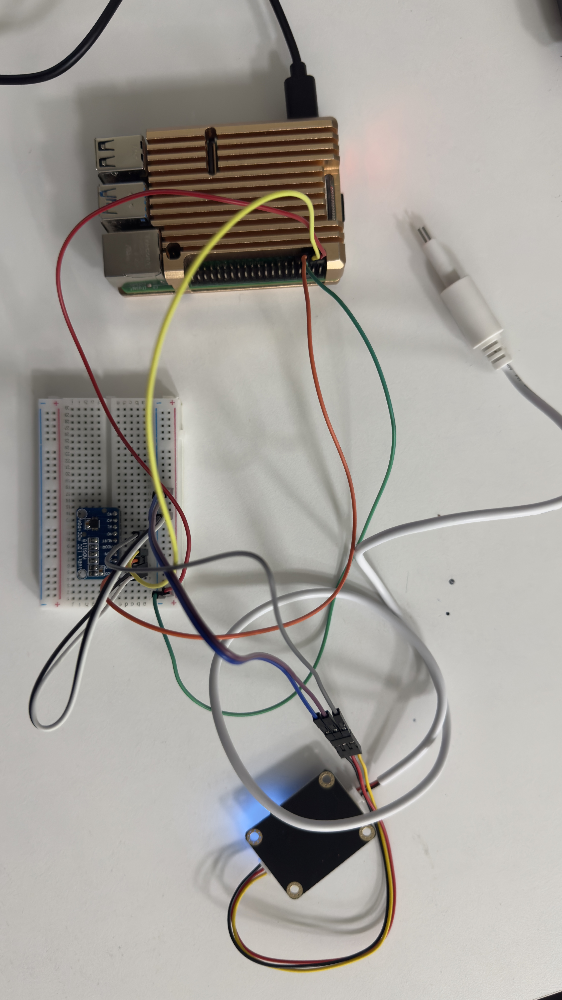
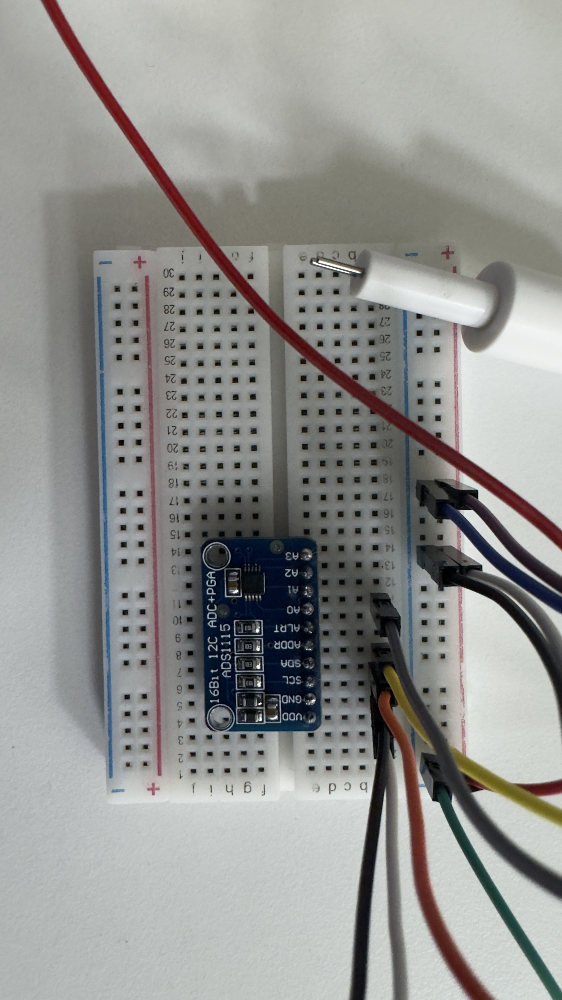
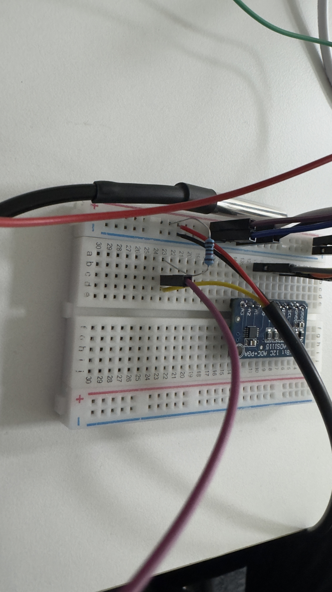

# Water-quality monitoring – status update

## Overview

We built and validated the core hardware for a real water-quality monitoring system on a Raspberry Pi.

First, we connected and configured an **ADS1115** analog-to-digital converter so the Pi could read analog sensor signals. After confirming communication via I²C, we connected a **TDS (Total Dissolved Solids)** sensor and verified real voltage readings from water. We added filtering to stabilize readings and logic to detect whether the probe is in water or not.

Next, we integrated a **DS18B20 temperature sensor** over the Pi’s **1-Wire** interface. After enabling the kernel driver and wiring it correctly, the Pi detected the sensor and assigned it a unique hardware ID.

The system can now:

- Read real analog sensor data (TDS)
- Convert it into meaningful measurements (ppm)
- Filter noise and stabilize readings (moving average)
- Detect sensor state (wet vs dry for TDS)
- Measure temperature digitally (DS18B20)

**Technically:** we have a working embedded sensor pipeline: *physical environment → sensor → signal → converter → Raspberry Pi → processed data* — the same architecture used in real IoT monitoring devices.

---

## Current system status

| Component              | Status   |
|------------------------|----------|
| ADC communication      | Working  |
| TDS readings           | Stable   |
| Signal filtering       | Implemented |
| Temperature sensing    | Working  |
| Hardware wiring        | Verified |

**Where we are:** Hardware validation is done (the hardest part). From here on, the rest is software integration and feature building.

---

## Setup photos

**Raspberry Pi**



**Breadboard (ADS1115 + TDS probe)**



**DS18B20 temperature sensor (1-Wire)**



---

## Hardware

### I2C – ADS1115

ADS1115 is on I2C bus 1 at address **0x48** (default). Scan:

```
admin@sensors-pi:~/sensors-env $ i2cdetect -y 1
     0  1  2  3  4  5  6  7  8  9  a  b  c  d  e  f
00:                         -- -- -- -- -- -- -- -- 
10: -- -- -- -- -- -- -- -- -- -- -- -- -- -- -- -- 
20: -- -- -- -- -- -- -- -- -- -- -- -- -- -- -- -- 
30: -- -- -- -- -- -- -- -- -- -- -- -- -- -- -- -- 
40: -- -- -- -- -- -- -- -- 48 -- -- -- -- -- -- -- 
50: -- -- -- -- -- -- -- -- -- -- -- -- -- -- -- -- 
60: -- -- -- -- -- -- -- -- -- -- -- -- -- -- -- -- 
70: -- -- -- -- -- -- -- --                         
```

### 1-Wire – DS18B20

Temperature sensor is on the Pi’s 1-Wire bus. Enable it with: **raspi-config → Interface Options → 1-Wire**. The kernel exposes devices under `/sys/bus/w1/devices/` with addresses starting with `28` (DS18B20 family).

---

## Sensor 1: TDS

- TDS probe wired to ADS1115 (I2C) on channel 0.
- Script reads voltage, applies a 10-sample moving average, and converts to TDS (ppm). When the probe is out of water (voltage &lt; 0.15 V), it reports `---`.

**`read_tds.py`** – main logic:

```python
import time
from collections import deque

import board
import busio
import adafruit_ads1x15.ads1115 as ADS
from adafruit_ads1x15.analog_in import AnalogIn

i2c = busio.I2C(board.SCL, board.SDA)
ads = ADS.ADS1115(i2c)
chan = AnalogIn(ads, 0)

IN_WATER_VOLTAGE_THRESHOLD = 0.15
SMOOTHING_SAMPLES = 10

voltage_history = deque(maxlen=SMOOTHING_SAMPLES)

while True:
    raw = chan.voltage

    if raw < IN_WATER_VOLTAGE_THRESHOLD:
        voltage_history.clear()
        print(f"Voltage: {raw:.3f} V   TDS: --- (probe out of water)")
        time.sleep(1)
        continue

    voltage_history.append(raw)
    voltage = sum(voltage_history) / len(voltage_history)

    tds = (133.42 * voltage**3 - 255.86 * voltage**2 + 857.39 * voltage) * 0.5
    print(f"Voltage: {voltage:.3f} V   TDS: {int(tds)} ppm")

    time.sleep(1)
```

**Sample TDS output** (probe in and out of water):

```
Voltage: 0.007 V   TDS: --- (probe out of water)
Voltage: 0.582 V   TDS: 219 ppm
Voltage: 0.578 V   TDS: 217 ppm
...
Voltage: 0.644 V   TDS: 240 ppm
Voltage: 0.106 V   TDS: --- (probe out of water)
```

**Findings:** Out of water &lt; 0.15 V; in water ~0.55–0.64 V, TDS ~208–240 ppm. Moving average smooths readings; history is cleared on “out of water” so re-entry is responsive.

---

## Sensor 2: Temperature (DS18B20)

- DS18B20 on 1-Wire; script reads `/sys/bus/w1/devices/28*/w1_slave`.
- Same approach as TDS: 10-sample moving average, and on read/CRC error we clear history and print `---`.

**`read_temp.py`** – main logic:

```python
import glob
import time
from collections import deque

BASE_DIR = '/sys/bus/w1/devices/'
SMOOTHING_SAMPLES = 10

device_folders = glob.glob(BASE_DIR + '28*')
if not device_folders:
    raise RuntimeError('No DS18B20 found. Enable 1-Wire: raspi-config → Interface Options → 1-Wire')
device_file = device_folders[0] + '/w1_slave'

temp_history = deque(maxlen=SMOOTHING_SAMPLES)

def read_temp_raw():
    """Returns (ok, temp_c) or (False, None) on CRC/parse error."""
    try:
        with open(device_file) as f:
            lines = f.readlines()
    except (OSError, IOError):
        return False, None
    if len(lines) < 2 or 'YES' not in lines[0] or 't=' not in lines[1]:
        return False, None
    temp_c = float(lines[1].split('t=')[1]) / 1000
    return True, temp_c

while True:
    ok, raw = read_temp_raw()
    if not ok:
        temp_history.clear()
        print("Temperature: --- (read error)")
        time.sleep(1)
        continue
    temp_history.append(raw)
    temp = sum(temp_history) / len(temp_history)
    print(f"Temperature: {temp:.2f} °C")
    time.sleep(1)
```

**Sample temperature output:**

```
Temperature: 24.56 °C
Temperature: 24.50 °C
Temperature: 24.48 °C
Temperature: 24.50 °C
Temperature: 24.64 °C
```

**Findings:** Sensor detected via 1-Wire; readings are smoothed and invalid reads are handled without crashing.

---
